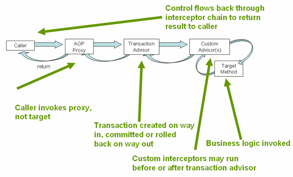
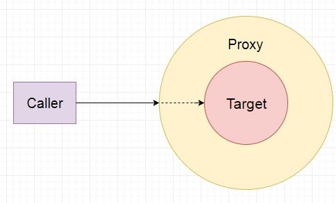

## Задание 5

**Объяснить как отрабатывает @Transactional**



1. При инициализации Spring поверх объекта создается proxy объект, который при запросе снаружи и будет принимать запросы
2. При поступлении запроса сначала отрабатывается логика Transaction Advisor, производится открытие транзакции если задано требование ее наличия при работе, указано поведение Propagation.REQUIRES_NEW или это первая транзакция
3. Далее управление передается пользовательским аспектам (при наличии), а далее целевому объекту.
    - При обращении к методам внутри целевого объекта обращение идет уже к самому целевому объекту, а не к proxy обертке. Т.е. при обращении к методам с аннотацией @Transactional внутри целевого объекта не запустит логику обработки транзакций.   
         
   
    ```java
    public class Proxy {
        private ServiceTest targetService;
    
        public void test1() {
            //код начала транзакции
            // ...
            targetService.test1();
            //код конца транзакции
            // ...
        }
    
        public void test2() {
            //код начала транзакции
            // ...
            targetService.test2();
            //код конца транзакции
            // ...
        }
    }
   ```
4. По завершению работы в вызванном методе целевого объекта управление возвращается в обратном порядке. В последнюю очередь - к Transactional Advisor.
При выбросе исключения при наличии активной транзакции и наличии требования, что нужно откатить транзакцию при ее возникновении, транзакция откатывается
Если работа завершилась успешно, без исключений или были исключения, на которые не требуется откат, то транзакция закрывается (если это не сквозная транзакция через несколько бинов)

[_Содержание_](../README.md)
